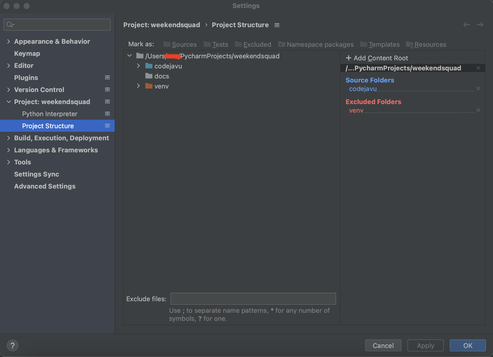

[//]: # (# codjvu)

[//]: # (yet another codejavu-backend rebuild, this time in django)

# Codejavu Web Backend 
### Required
1. Docker
2. Python 3.10
3. IDE(VSCODE/Pycharm) 
4. Postman/Insomnia [Postman is preferable]
> The latest version of Insomnia is constantly crashing in Mac

## First Time
1. `git clone` this repository
2. go to `/docker` and open terminal then run `docker-compose up --build`
3. set `Python Interpreter` as venv of _Python 3.10_ from the IDE
   1. **VSCODE** https://code.visualstudio.com/docs/python/environments#_using-the-create-environment-command
   2. **PYCHARM** https://www.jetbrains.com/help/pycharm/creating-virtual-environment.html#python_create_virtual_env
   3. **Manually** https://docs.python.org/3.10/library/venv.html
        > python -m venv venv source venv/bin/activate
4. Install packages `pip install -r requirements.txt`
5. Set the root of the project 
   Example of Pycharm 
    
6. Run DB migration `python manage.py migrate`
7. Finally run `python manage.py runserver`

## Next Time
1. go to `/docker` and open terminal then run `docker-compose up --build`
2. Activate venv `source venv/bin/activate` (only for manual method)
3. run `python manage.py runserver`

# Dev Guide
Django Rest API is used for the backend.
JWT Authentication is used instead of session.
4 modules.
1. codejavu -> main module
2. custom_auth -> auth module
3. manager -> system admin module
4. snippet -> user module

`@csrf_exempt` decorator is used when csrf check is not necessary.
`@enforce_csrf` decorator is used to enforce checking csrf

## Resources

1. [swagger](docs/codejavu_swagger.yaml)
2. [db image](docs/codjvu_db.drawio.png)

